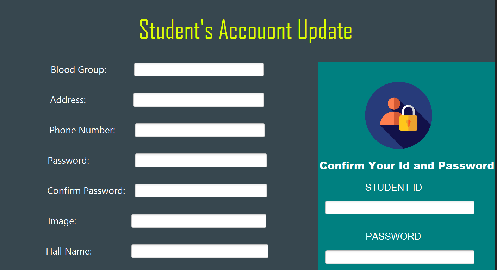
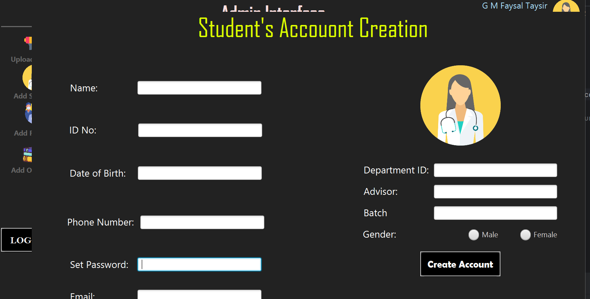
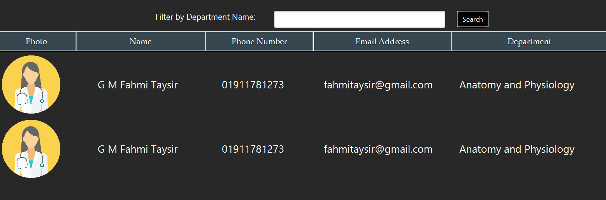
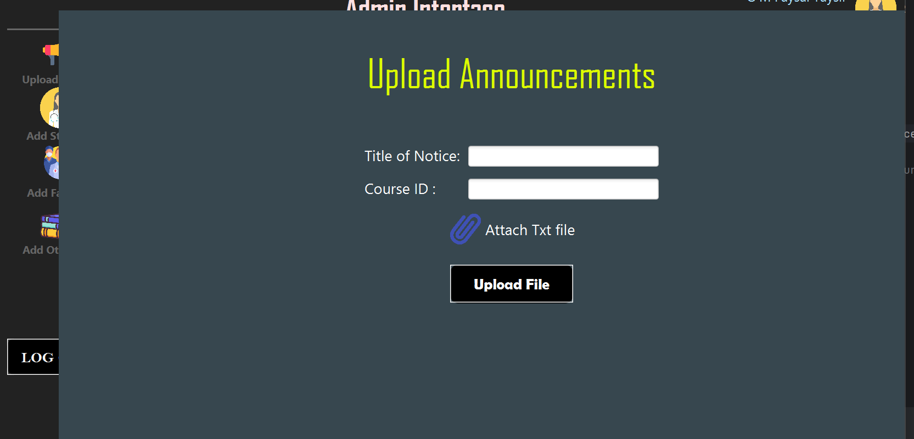
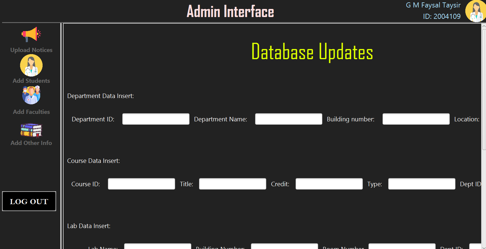
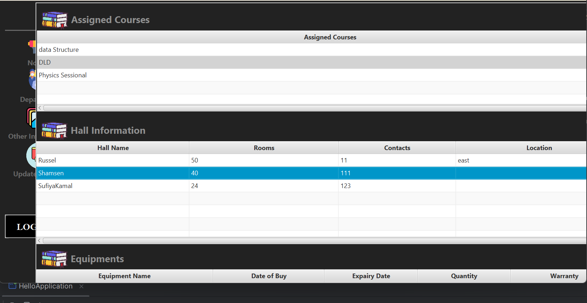

# Medical College Management System
A Medical College Management System, comprehensive software solution designed to streamline administrative tasks, academic activities, and resource management within a medical college. It facilitates efficient handling of student records, faculty data, course schedules, and hospital integration for practical training, ensuring smooth operations and enhanced productivity.

|    |   |  
|----------------------------------------------------------|-------------------------------------------------------|
|    |   |  
|   |  |  

